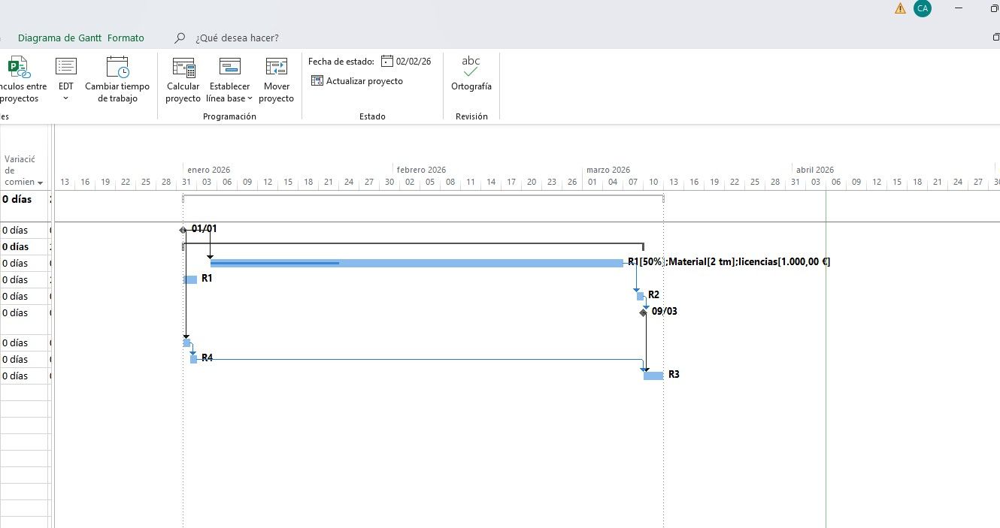
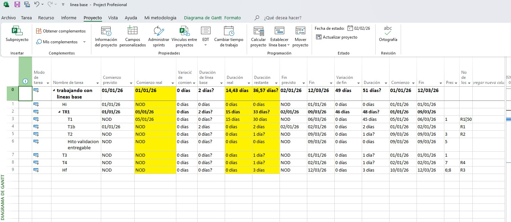
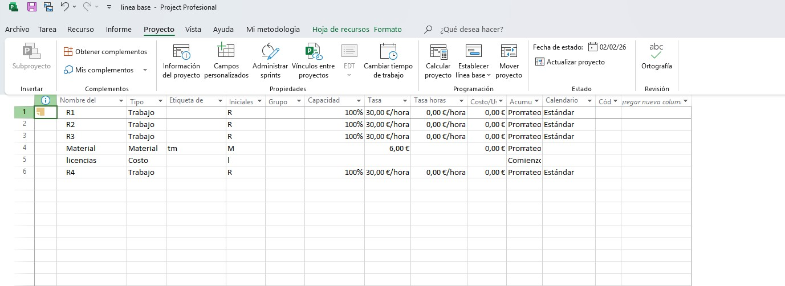

Este repositorio contiene un cronograma detallado desarrollado en Microsoft Project enfocado en el seguimiento riguroso de una planificación frente a la ejecución real. El proyecto demuestra habilidades avanzadas en la gestión de tiempos, asignación de recursos multimodales y análisis de desviaciones.

📊 Características del Proyecto

Gestión de Línea de Base: El proyecto incluye una planificación inicial consolidada para comparar el desempeño programado vs. el real.

Estructura de Desglose de Trabajo (EDT): Organización jerárquica por fases (TR1, Tareas operativas e Hitos de validación).

Asignación de Recursos Multimodal:

Trabajo: Recursos humanos (R1, R2, R3, R4) con tasas horarias definidas.

Material: Control de consumibles con costo unitario.

Costo: Gestión de licencias y gastos fijos no vinculados a la duración.

Control de Desviaciones: Seguimiento de variaciones en las fechas de inicio y fin, así como cálculo de duración real y restante.

🛠️ Aspectos Técnicos Demostrados
Tipos de Tareas: Uso de tareas de Unidades Fijas para un control preciso de la carga de trabajo.

Hitos de Control: Implementación de hitos de validación de entregables para asegurar la calidad en puntos críticos.

Análisis de Seguimiento: Configuración de vistas con columnas de seguimiento personalizadas para detectar retrasos (como se observa en la tarea T1 con inicio real desviado).

📂 Contenido del Repositorio

Proyecto_Control_Lineas_Base.mpp: Archivo fuente de MS Project.

Hoja_de_Recursos.pdf: Detalle del equipo, materiales y costos asociados.

Diagrama_Gantt_Seguimiento.pdf: Exportación visual del cronograma con la ruta crítica y desviaciones resaltadas.
